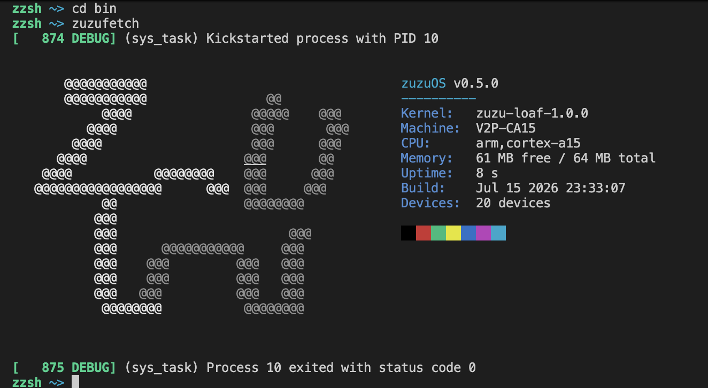

# zuzu,  a minimal ARMv7-A microkernel

zuzu is a microkernel targeting AArch32 / ARMv7-A. It's written in C and ARM assembly from scratch. The kernel runs on QEMU's `vexpress-a15` machine (Cortex-A15) and is designed from the very first principles around microkernel principles: a minimal kernel, strict process isolation, and I/O through inter-process messaging (IPC).

This project started as a hobby project and grew into a full systems programming exploration. The goal is a complete, understandable microkernel, something that demonstrates how a real OS kernel works at every level.

zuzu is like a holy grail of projects for me. I've always wanted to build an OS from scratch, use all the concepts of systems programming in one giant project, as well as create a legacy that could tie things in my life together. The name "zuzu" is a tribute to our family cat, Zuzu, who's 1 year old at the time of me writing this.

(wip)

## Credits

- zuzu logo designed by Zoz

---

## License

MIT License. See [LICENSE](LICENSE) for details.
