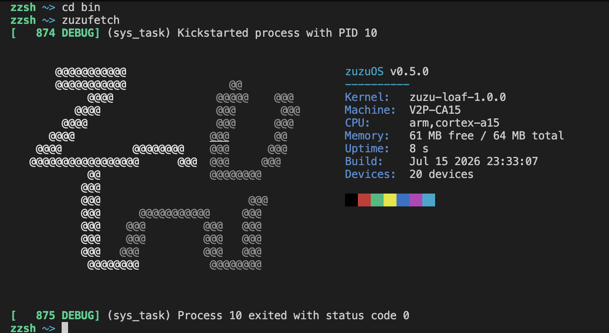

# zuzu

**A capability-based microkernel for ARMv7-A.**



zuzu is a microkernel written from scratch in C and ARM assembly, targeting
AArch32 / ARMv7-A. **zuzuOS** is the userspace that runs on top of it: drivers,
a filesystem server, a network stack, and a shell which are packed all as ordinary isolated processes communicating through IPC. It currently runs on QEMU's `vexpress-a15` (Cortex-A15) and is physically tested on the **Raspberry Pi 4**
(BCM2711, Cortex-A72).

Microkernels have a reputation for being too slow for practical use. I believe this is a
reputation earned by Mach in the early 1990s and never fully shaken. zuzu is an
argument that this is no longer true for the embedded, IoT, and router-class
systems where isolation matters most.

## About

This began as a hobby project, a way to put every piece of systems programming
I cared about into one place and became a master's thesis and undergraduate
capstone. It is still the project I most wanted to build. It is named after our cat, Zuzu, a Scottish Fold.

## Design

Everything the kernel exposes is a **handle**. Holding a handle *is* the
permission to use the object it names. A task can do exactly what its space holds
handles for, and nothing else.

**Kernel**
- Address spaces, USR-mode execution, ASID-tagged TLB
- Preemptive priority scheduling, up to 255 threads per process
- IPC: messages, events, shared memory
- ELF/ZXF loading from an initrd, task lifecycle

**zuzuOS**
- Supervisor/init, a standalone name server, a VFS server, a device manager
- A UART driver and an interactive shell
- Userspace device drivers
- A network stack running entirely in userspace: LAN9118 driver -> Ethernet /
  ARP / IPv4 / ICMP -> UDP/TCP, with a full state machine, RFC 6298
  retransmission timing with Karn's algorithm, and out-of-order reassembly

**Crash recovery**
- Will be implemented in the next major version of zuzuOS.

## Status

Under active development. The kernel ABI is stable between minors of the same major. See roadmap for recent development updates.

## Documentation

All documentation has been moved to the zuzu docs website. Visit [https://kagantmr.github.io/zuzu-docs](https://kagantmr.github.io/zuzu-docs) for the latest information on the kernel, userspace, and development.

## Repository layout

```
zuzu/
├── CONTRIBUTING.md        // How to contribute to zuzu
├── Kconfig                // Top-level kernel configuration
├── LICENSE                // MIT license
├── Makefile               // Top-level build entry point
├── README.md              // You're here!
├── arch                   // Architecture-specific kernel code (ARMv7-A)
├── bsp                    // Per-board support: layout, boot and SD manifests, linker scripts
├── core                   // Bare kernel: kprintf, ksym, panic, etc.
├── docs                   // Documentation
├── drivers                // Kernel-side drivers: UART, RTC
├── include                // Shared headers and the userspace IPC runtime (sync, net, fs, dev, util)
├── initrdroot             // Optional: files here are packed into the initrd (not tracked by default)
├── kernel                 // Kernel code: scheduling, IPC, memory management, etc.
├── klib                   // Kernel library: string, memory, etc.
├── lib                    // Userspace library: ZCRT, newlib
├── requirements.txt       // Host-side Python dependencies
├── scripts                // Makefile fragments, elf2zxf, Raspberry Pi config, etc.
├── sdroot                 // Files copied as-is into the SD card image
├── tests                  // QEMU test runner and manifests
├── user                   // Userspace: drivers, services (fsd, netd, ttysvc), shell, apps
└── vendor                 // Third-party libraries (kconfiglib, libfdt)
```

## Versioning

Kernel releases are tagged `zuzu-vX.Y.Z-<codename>`, where the codename tracks
the major version. 

Major versions are named after how a cat sits: **Loaf**
(1.x), **Prowl** (2.x), **Knead** (3.x), **Pounce** (4.x).

zuzuOS versions are named after drinks.

## Credits

- zuzu logo designed by Zoz

## License

MIT. See [LICENSE](LICENSE).
