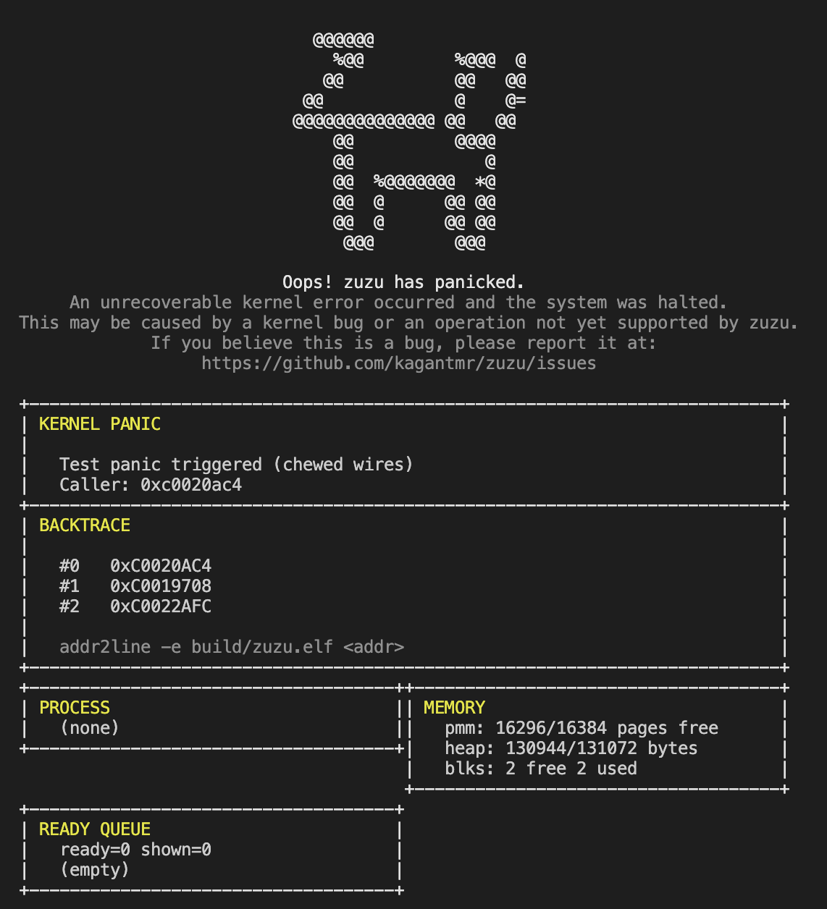

# zuzu Debugging Guide

This document covers debugging info the zuzu kernel: GDB setup, reading panic screens, interpreting fault output, and common failure paths.

---

## GDB Workflow

### Start a debug session

In one terminal, start QEMU halted waiting for debugger:
```bash
make debug
```

In another terminal, attach GDB:
```bash
arm-none-eabi-gdb build/zuzu.elf
(gdb) set architecture armv7
(gdb) target remote :1234
```

### Useful commands

```bash
# Break at a specific function
(gdb) break kmain
(gdb) break exception_dispatch

# Change layout
(gdb) layout split

# Break at a specific address
(gdb) break *0xC001896C

# Print current registers
(gdb) info registers

# Inspect memory (20 words at address 0xC0027000)
(gdb) x/20wx 0xC0027000

# Disassemble around current PC
(gdb) disas $pc,+64

# Print a struct
(gdb) p *current_process
(gdb) p *(exception_frame_t *)0xC07FF000

# Walk the run queue manually
(gdb) p run_queue

# Decode an ARM instruction word
(gdb) x/i 0x00010008

# addr2line — match panic caller address to source line
# (run on host, not inside GDB)
arm-none-eabi-addr2line -e build/zuzu.elf 0xC001896C
```

---

## Reading the Panic Screen



When zuzu panics, it prints an informative screen with the following sections:

### Header
```
Kernel-level prefetch abort
Caller: 0xc001896c
```
`Caller` is the LR at the time of panic — the return address from wherever `panic()` was called. Run `addr2line -e build/zuzu.elf <caller>` to get the exact source line.

### Fault Details
```
Type:   Prefetch abort
Fault:  Translation fault (page)
FSR:    0x00000007
```
`FSR` / `IFSR` encodes the fault type. See the fault status table below. **Note:** on a kernel-mode null pointer call (`pc=0x00000000`), the FSR may reflect the previous user fault — those registers are not cleared between exceptions on ARMv7.

### Registers
```
lr = 00000000   pc = 00000000
cpsr = A0000193
```
`cpsr & 0x1F` gives the mode at fault time: `0x13` = SVC (kernel), `0x10` = USR (user). `lr=0x00000000` with `pc=0x00000000` means a null function pointer call. `lr=pc` means execution fell off the end of a function (missing exit syscall or infinite loop).

### Process Panel
Shows the faulting process's PID, state, address space pointer, and scheduler fields. Useful for cross-referencing with the ready queue.

### Ready Queue
Lists processes that were runnable at panic time. Useful for spotting stuck IPC partners (e.g., a sender blocked forever because its receiver already died).

---

## Fault Status Reference (FSR / IFSR)

| Status | Meaning |
|--------|---------|
| `0x05` | Translation fault (section) — L1 page table entry missing |
| `0x07` | Translation fault (page) — L2 page table entry missing |
| `0x0D` | Permission fault (section) — AP bits rejected access |
| `0x0F` | Permission fault (page) — AP bits rejected access |
| `0x01` | Alignment fault |
| `0x08` | Synchronous external abort |

**Translation fault (section)** at a user address (`0x00010008` etc.) is a normal user process fault — the process jumped to an address that isn't mapped. This is expected and handled by killing the process.

**Translation fault (page)** at `0x00000000` in SVC mode is a null pointer call inside the kernel.

**Permission fault** means the page is mapped but the AP bits deny access — usually a user process touching kernel memory, or the kernel touching a guard page.

---

## Common Failure Patterns

### `pc=0x00000000, lr=0x00000000` in SVC mode

Null function pointer call inside the kernel. Causes:
- Uninitialized callback in a struct (IRQ handler table, tick callback, etc.)
- Use-after-free: a struct was freed but a pointer to it survived; the freed memory was zeroed or reused, and a function pointer field became zero
- `context_switch(prev, next)` where `prev`'s kernel stack was freed before the switch completed

Get the `Caller` address from the panic screen and run `addr2line` to find the exact call site.

### `pc=lr` (e.g., both `0x00010008`) in USR mode

A user process executed past the end of its code. The process's program page only has N instructions but execution continued past them into unmapped memory. Every test process must end with `SVC #0x00` (exit) or an infinite loop (`B .`).

### `pc=0x00010000, lr=0x7FFFF000` in USR mode

The process entry trampoline returned — the process function returned to `process_entry_trampoline` which then returned to the user stack top address. The user process has no `exit()` call and returned from its top-level function.

### Heisenbug: adding/removing `KDEBUG` changes behavior

`kprintf` takes hundreds of microseconds at UART baud rates. This changes scheduler interleaving. If a bug disappears when you add a print, it is a race condition or use-after-free where timing determines whether the bad memory access occurs before or after reuse. Do not remove the print to "fix" it — find the underlying issue.

### Double-panic or panic with stale FSR

ARMv7 does not clear DFAR/DFSR/IFAR/IFSR between exceptions. If a user process fault fires immediately before a kernel fault, the fault details in the panic screen may reflect the user fault, not the kernel fault. Cross-check against `pc` and `cpsr` mode bits — if `pc=0x00000000` and `cpsr` shows SVC mode, the fault detail is almost certainly stale.

### Zombie process causing NULL dereference in scheduler

If `sched_defer_destroy(p)` is called and then `sched_reap()` runs before `context_switch()` completes, the kernel stack backing `prev` is freed while the context switch is still writing to it. Symptom: corrupted kernel state one or two ticks after a process exits, not immediately. Fix: ensure `current_process = NULL` before calling `schedule()` from a fault handler, so `context_switch(NULL, next)` skips saving the outgoing context.

---

## Interpreting the SPSR / return_cpsr Field

The `spsr` line in fault output shows the processor state **before** the exception was taken:

```
spsr=00000010 [USR mode, if]   ← fault came from user process
spsr=60000093 [SVC mode, If]   ← fault came from kernel code
spsr=A0000193 [SVC mode, If]   ← kernel fault, N and Z flags set
```

Mode bits `[4:0]`: `0x10`=USR, `0x13`=SVC, `0x12`=IRQ, `0x17`=ABT.  
`I` (bit 7): IRQ masked. `F` (bit 6): FIQ masked.  
Lowercase = not set, uppercase = set.

The exception handler uses `spsr & 0x1F` to determine whether to kill the process (USR) or panic the kernel (SVC/other). If this check is wrong — e.g., branching on `current_process != NULL` instead of on the mode bits — a user fault with `current_process == NULL` will incorrectly trigger a kernel panic.

---

## See Also

- `arch/arm/exceptions/exception.c` — fault dispatch and mode checking
- `kernel/sched/sched.c` — scheduler, reap queue
- `kernel/proc/process.c` — process creation and destruction
- [arch.md](arch.md) — exception model, SPSR, LR adjustment
- [processes.md](processes.md) — kernel stack layout, context switch
