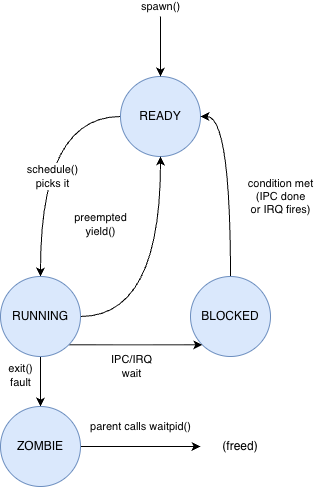

# zuzu Process Model

This document describes how processes are represented, created, scheduled, and destroyed in zuzu.

---

## Process Control Block (`kernel/proc/process.h`)

Every process is represented by a `process_t` struct. The fields that matter most to the runtime are:

- `pid` / `parent_pid`
- `process_state`
- `kernel_sp` and `kernel_stack_top`
- `as` (the process address space)
- `trap_frame` (saved user register state)
- `handle_table` (typed capability table)
- `ipc_buf_pa` and `ipc_buf_xfer_len` (shared IPCX page and active transfer length)
- `ipc_state`, `blocked_endpoint`, `pending_reply_cap`, and `wake_reason`

The handle table is not an array of raw pointers. It is a capability vector; each slot stores an object type plus the object union for that capability.

```c
typedef struct process
{
    uint32_t pid, parent_pid;
    p_state_t process_state;
    uint32_t *kernel_sp;
    uintptr_t kernel_stack_top; // base of kernel stack for freeing
    uint64_t wake_tick;
    uint32_t priority, time_slice, ticks_remaining;
    addrspace_t *as;
    list_node_t node; // embedded, not pointers
    list_node_t timeout_node;
    int32_t exit_status;
    uint32_t waiting_for;
    char name[32];           // PROCESS name
    uint32_t device_va_next; // initialized to USER_DEVICE_BASE in process_create
    uint32_t mmap_va_next;   // initialized to USER_MMAP_BASE in process_create
    exception_frame_t *trap_frame;
    list_head_t outstanding_replies;
    handle_vec_t handle_table;
    uintptr_t ipc_buf_pa;
    reply_cap_t *pending_reply_cap;
    uint32_t ipc_buf_xfer_len;
    ipc_state_t ipc_state;
    wake_reason_t wake_reason;
    endpoint_t *blocked_endpoint;
    uint32_t flags;
    list_head_t children;
    list_node_t sibling_node;
} process_t;
```

---

## Process States



- `READY` — process is ready to run, sitting in the scheduler's run queue
- `RUNNING` — process is currently executing on the CPU
- `BLOCKED` — process is waiting for an event (e.g., IPC or timer tick) and is not runnable
- `STOPPED` — process has been created but not started yet
- `ZOMBIE` — process has exited but has not been reaped by its parent yet. Its PCB still exists so the parent can query its exit status, but it is not runnable and does not consume resources.

---

## User-Space Layout

The user address space follows a common layout contract across all processes:

| Virtual Range | Purpose |
| ------------- | ------- |
| `0x00001000` | Syspage (`USER_SYSPAGE_VA`) |
| `0x00010000` | ELF load base (`USER_ELF_BASE`) |
| `0x20000000` | Anonymous mmap base (`USER_MMAP_BASE`) |
| `0x7F000000` | Device mapping window (`USER_DEVICE_BASE`) |
| `0x7FFFA000` | IPCX buffer (`USER_IPC_BUF_VA`) |
| `0x7FFFB000` | Stack guard page (`USER_STACK_GUARD_VA`) |
| `0x7FFFC000` - `0x80000000` | User stack (`USER_STACK_BASE` / `USER_STACK_TOP`) |

`process_create_from_elf()` maps the syspage, IPCX buffer, user stack, and stack guard for ELF-loaded tasks. `process_create()` sets up the syspage and IPCX mapping for stopped tasks created at runtime.

---

## Kernel Stacks

Each process has its own kernel stack, separate from its user stack. The kernel stack is used when the process is executing in kernel mode (during a syscall or IRQ that interrupted the process).

The kernel stack is allocated from the PMM as a contiguous chunk of pages. `kernel_stack_top` records the physical base of that allocation so it can be freed when the process is destroyed. `kernel_sp` is the current stack pointer value; it moves as things are pushed and popped during exceptions.

If `kernel_sp` is corrupted, the next exception will usually fault while the kernel is trying to save or restore context.

---

## Context Switch (`arch/arm/exceptions/switch.s`)

Context switching in zuzu saves and restores the callee-saved register set (`r4`-`r11`, VFP registers plus `lr`) on the kernel stack. The scheduler switches by loading `next->kernel_sp` and restoring that saved context.

For a brand-new process, the kernel stack is pre-initialized so the first return from the scheduler lands in `process_entry_trampoline`. That trampoline installs the user stack pointer and then returns to user mode through the exception frame.

---

## Address Spaces

Each process has an `addrspace_t *as` pointer. The address space contains an L1 page table and a vector of `vm_region_t` mappings. On a context switch, `TTBR0` is written with the physical address of the new process's L1 table. `TTBR1` (kernel mappings) never changes.

Address spaces are managed through VMM policy code. `as_create()`, `vmm_add_region()`, `vmm_map_range()`, `vmm_remove_region()`, and `as_destroy()` define the policy, while the architecture layer handles the actual page-table writes and TLB maintenance.

---

## Process Creation (`kernel/proc/process.c`)

`process_create_from_elf()` is used by the boot path and service launcher code. It validates the ELF image, maps each `PT_LOAD` segment, installs the user stack and guard page, and maps the syspage plus IPCX buffer.

`process_create(name)` is used by `task_tspawn()`. It allocates a blank stopped process, initializes the kernel stack and address space, maps the syspage and IPCX buffer, and sets up the initial handle table. Once the name-table endpoint exists, slot 0 is populated automatically.

The stopped task then becomes runnable only after `task_kickstart()` installs the initial user register state and moves the process to `PROCESS_READY`.

For runtime task bootstrap, the standard pattern is: `task_tspawn` -> `asinject` (init only) -> `task_kickstart`.

---

## Process Destruction

`process_destroy(p)` is called when a ZOMBIE process is reaped:

1. Frees the address space (`as_destroy()` — walks page tables and frees mapped pages where appropriate).
2. Frees the kernel stack.
3. Frees the IPCX backing page.
4. Frees the `process_t` struct itself.

The scheduler currently reaps zombie processes.

---

## Scheduler (`kernel/sched/sched.c`)

zuzu uses a simple round-robin scheduler. All ready processes sit in a linked list. On each tick, the scheduler picks the next process in the list, performs a context switch, and updates the current process pointer.

sched_init() initializes the scheduler's run queue. `sched_add()` adds a process to the end of the run queue. `sched_remove()` removes a process from the run queue (for example when it blocks or exits). `schedule()` performs a context switch to the next ready process.

`sched_add()` is called when a process is created or unblocked. `sched_remove()` is called when a process blocks on IPC or exits. `schedule()` is called on every timer tick and whenever a process voluntarily yields the CPU.

schedule() is the main scheduling function. It picks the next ready process from the run queue and performs a context switch. It also updates the `current_process` global pointer to point to the new process.

current_process is a global pointer that always points to the currently running process. This is important because when an exception (syscall or IRQ) occurs, the kernel needs to know which process was interrupted in order to access its PCB, address space, and other state. The current_process pointer is updated on every context switch to reflect the new running process.

The `ticks_remaining` mechanism implements preemption. Each process has a `time_slice` (number of ticks it is allowed to run before being preempted) and `ticks_remaining` (number of ticks left in the current time slice). On each timer tick, the scheduler decrements `ticks_remaining` for the current process. If it reaches 0, the scheduler preempts the process and switches to the next one in the run queue. When a process is scheduled, `ticks_remaining` is reset to `time_slice`.

The scheduler is triggered in two ways:
- **Timer tick** — `schedule()` is registered as a tick callback, called from the timer IRQ handler.
- **Voluntary** — IPC blocking syscalls and `task_yield` call `schedule()` directly.

---

## See Also

- `kernel/proc/process.c` - process_create, process_destroy, process_create_from_elf
- `kernel/proc/kstack.c` - kernel stack allocation with guard pages
- `arch/arm/exceptions/switch.s` - context switch assembly
- `kernel/sched/sched.c` - scheduler run queue and tick dispatch
- `kernel/mm/vmm.c` - address space management
- [ipc.md](ipc.md) - capability-based IPC, IPCX, and shared memory
- [arch.md](arch.md) - TTBR0 switching and user-mode entry